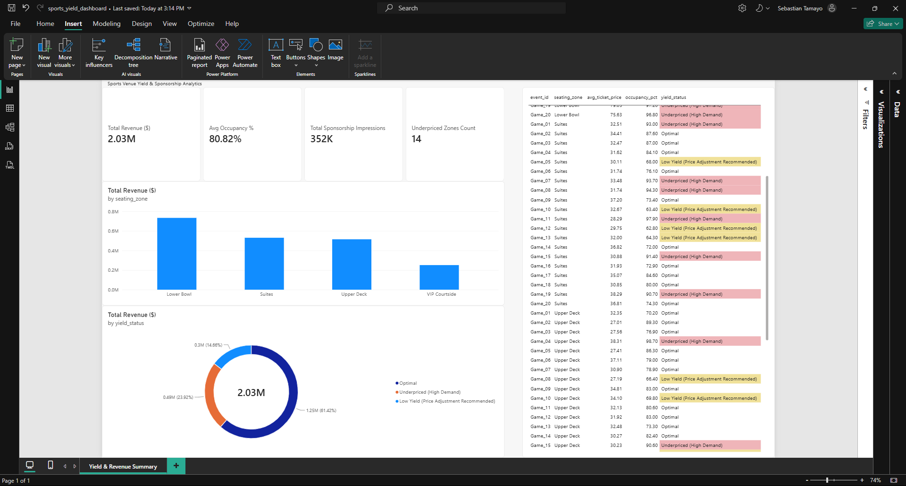

# Sports Venue Yield & Sponsorship Analytics Engine

An automated data pipeline and executive reporting suite built with **Python** and **Power BI**. This engine models ticket price elasticity, venue seating zone yield, and partner sponsorship exposure to maximize Revenue Per Available Seat (RevPAS) across event schedules.

---

## Repository Structure

```text
sports-yield-analytics-engine/
├── outputs/
│   ├── sports_analytics_metrics.json   # Executive summary & execution KPIs
│   └── sports_insights_summary.csv     # Transformed event-zone yield dataset
├── scripts/
│   └── yield_model.py                  # Python ETL & yield calculation engine
├── sports_yield_dashboard_preview.png # Power BI dashboard preview image
├── sports_yield_dashboard.pbix         # Power BI Desktop report file
├── .gitignore                          # Version control exclusions
├── LICENSE                             # MIT License
└── README.md                           # Technical project documentation

---

## Executive Dashboard Preview



---

## Business Problem & Overview
Sports and entertainment venues often face pricing inefficiencies where high-demand seating tiers are underpriced and lower-demand sections remain under-occupied. 

This engine solves this challenge by:
1. **Evaluating Seating Zone Elasticity:** Aggregating transactional ticket sales and occupancy percentages across 80+ venue zones.
2. **Sponsorship Impression Tracking:** Quantifying exposure potential across courtside, lower bowl, upper deck, and suite tiers.
3. **Automating Dynamic Pricing Signals:** Flagging underpriced, high-demand seating zones in real time to enable dynamic yield management.

---

## Technical Architecture

```text
[ Raw Transaction Engine ] ──> [ Python ETL Pipeline ] ──> [ Analytical Outputs ]
* Event & Zone Sales            - Pandas/NumPy Transformations  - sports_insights_summary.csv
* Sponsorship Exposure          - Elasticity & Yield Calculations- sports_analytics_metrics.json
* Occupancy Tracking            - Anomaly & Status Flagging                  │
                                                                             ▼
                                                                  [ Power BI Visual Layer ]
                                                                  - KPI Ribbon & DAX Measures
                                                                  - Yield Breakdown Charts
                                                                  - Conditional Audit Table